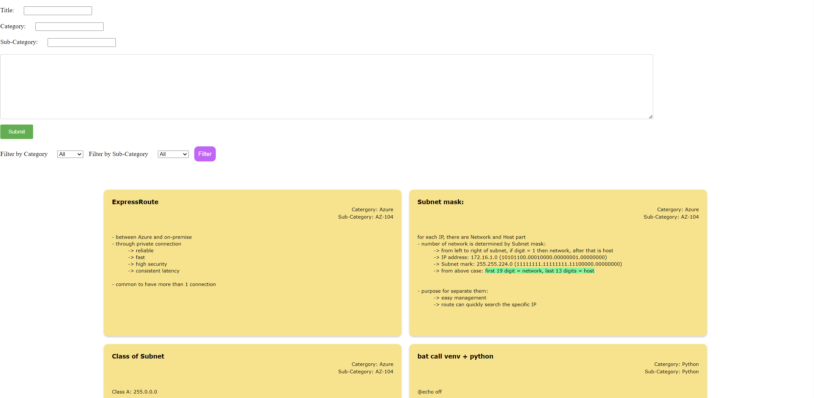
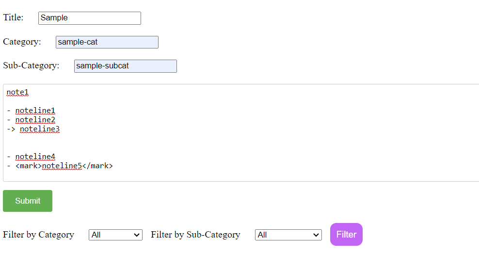
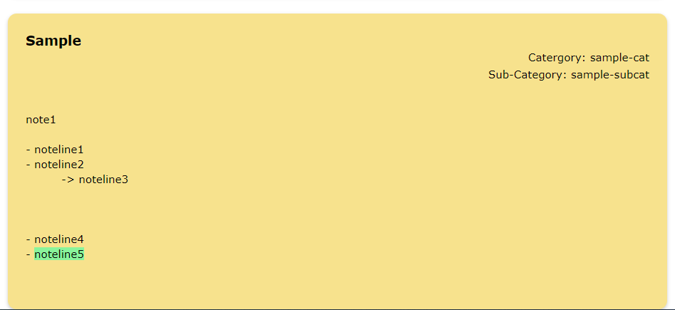
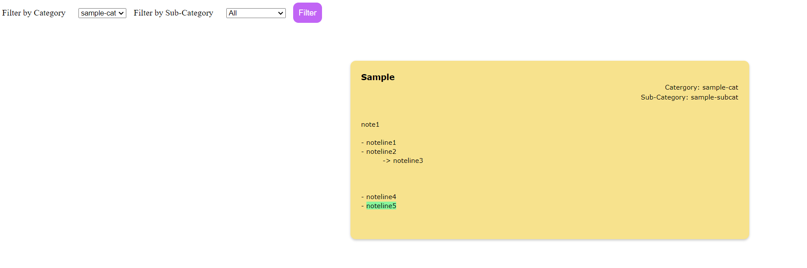
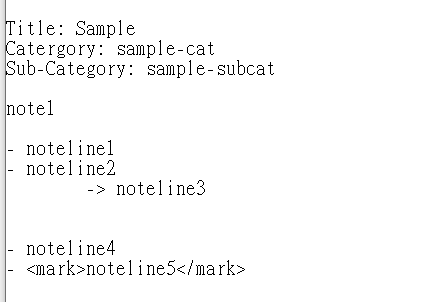

## Table of contents
* [General Information](#general-information)
* [Step of using](#step-of-using)
* [Installation](#installation)
* [Room for Improvement](#room-for-improvementlimitation)
* [remark](#remark)


# General Information
This project is simply designed for jotting notes and displayed like a sticky note wall on a webpage, the notes can be categorized which would be used for filtering.


# Step of Using
1. Execute main.py
```
python main.py
```
2. jot notes here and press submit


3. it will be displayed like a sticky note


4. use filter to find specific category of notes


5. record saved in .txt file




# Installation
```
pip install -r requirements.txt
```
 

# Room for Improvement/Limitation
- simple text input area without any tools
- no edit function, only available to edit .txt directly

# Remark
- html syntax allowed for the content
- the line with "->" as bullet will be indented


